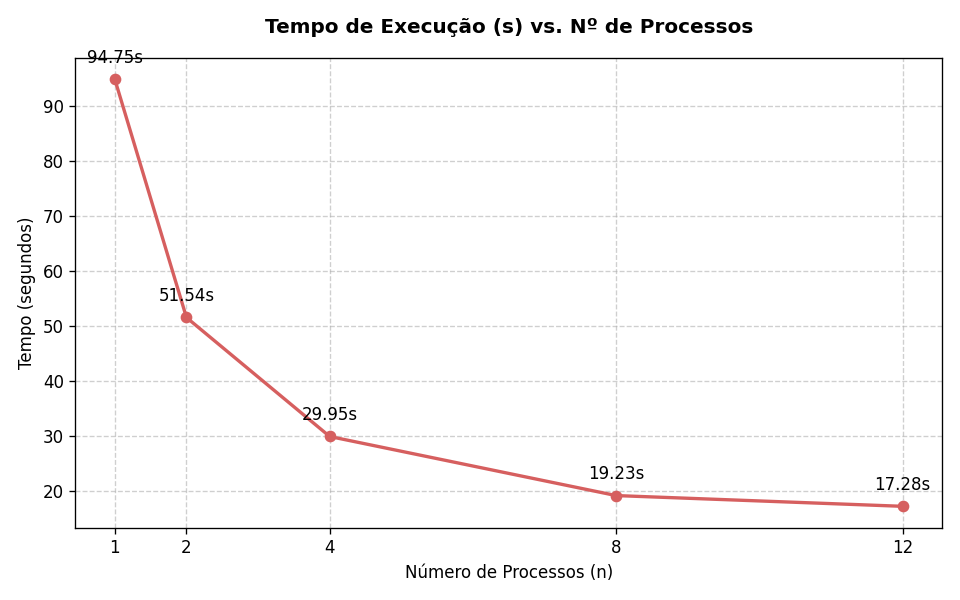
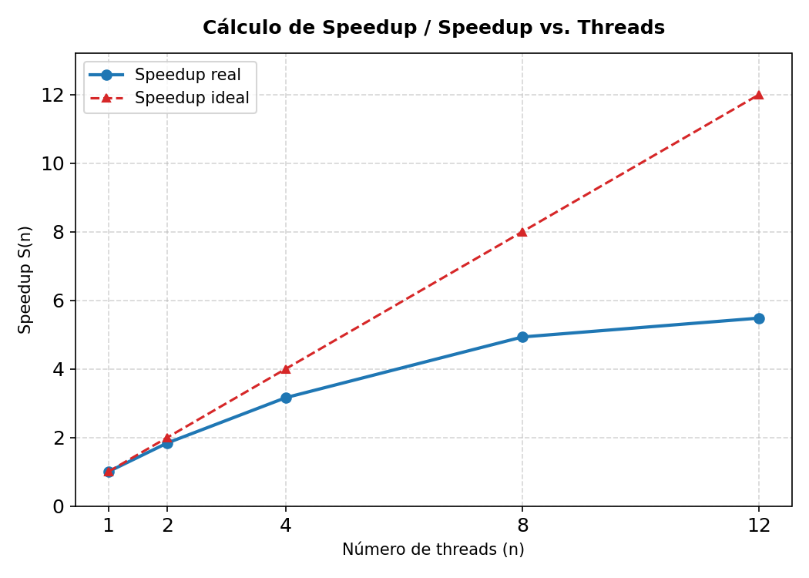
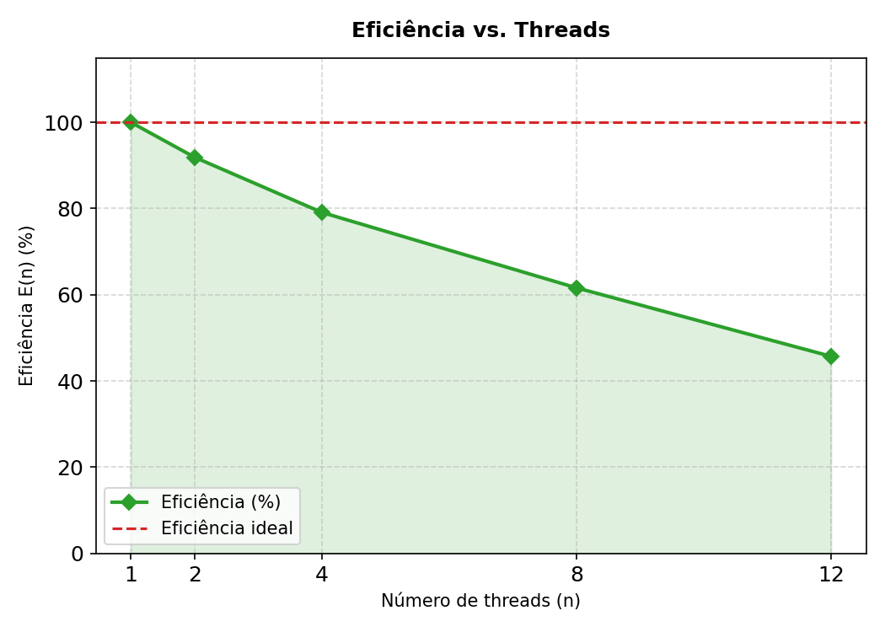

# 🔍 Web Server Log Analysis — Failed Request Detection

> Sistema acadêmico para análise de logs de servidores web utilizando conceitos de **Programação Distribuída e Concorrente**, com foco na identificação de requisições com falha, detecção de padrões suspeitos e avaliação de desempenho através de processamento paralelo com **memory-mapped I/O**.

---

## 👥 Integrantes

| Nome | RA |
|------|-----|
| Ana Júlia | 076130 |
| Vinícius Caetano de Assis | 075753 |

---

## 🎓 Informações Acadêmicas

| Campo | Informação |
|-------|------------|
| Curso | Análise e Desenvolvimento de Sistemas (ADS) |
| Disciplina | Programação Distribuída e Concorrente |

---

## 🎯 Objetivo do Projeto

O objetivo deste software é monitorar e analisar de forma automatizada logs de servidores web para identificar vulnerabilidades de segurança e falhas estruturais internas. Através do rastreamento de requisições anômalas e do mapeamento de IPs recorrentes, o sistema atua diretamente na detecção precoce de ameaças externas (como ataques de força bruta ou DoS) e no diagnóstico de erros de infraestrutura.

Para viabilizar essa análise em cenários de alta criticidade, o projeto foca em três pilares fundamentais:

* **Processamento de Alto Desempenho (Análise Massiva):** Capacidade de processar volumes massivos de logs (Apache/Nginx) de forma otimizada, mitigando o consumo de memória RAM por meio de técnicas de concorrência e processamento paralelo.
* **Segurança e Auditoria Avançada:** Varredura detalhada e categorização de erros HTTP (famílias 4xx e 5xx) para a rápida identificação de comportamentos suspeitos, mapeamento de origens maliciosas e mitigação de falhas críticas.
* **Benchmarking e Escalabilidade:** Avaliação empírica do comportamento do software em arquiteturas de hardware multi-core, aferindo métricas rigorosas de Speedup e Eficiência para validar a escalabilidade do sistema.

---

## 📌 Funcionalidades

- Leitura de arquivos de log via **memory-mapped I/O** (`mmap`), sem carregar o arquivo inteiro na RAM
- Divisão automática do arquivo em **chunks por byte-range**, garantindo distribuição uniforme entre processos
- Identificação de códigos HTTP de erro (4xx e 5xx) com regex compatível com Apache e Nginx
- Contabilização de falhas por endereço IP usando `collections.Counter`
- Geração do **ranking dos IPs com mais erros** (Top 10)
- Medição de desempenho com `time.perf_counter` comparando 1, 2, 4, 8 e 12 processos
- Cálculo automático de **Speedup** e **Eficiência** em tempo real

---

## 🛠 Tecnologias Utilizadas

* **Python 3:** Linguagem base devido à versatilidade e ao ecossistema de bibliotecas robustas para processamento concorrente.

* **Regex(re):** Expressões regulares altamente otimizadas e compiladas para extração ultrarrápida de IPs e status HTTP.

* **Memmory-Mapped:** Utilização de mmap para a leitura de ficheiros diretamente no espaço de endereçamento de memória do kernel.

* **Collections.Counter(Contagem eficiente de IPs):** É uma subclasse de dicionário do Python criada especificamente para contar objetos mutáveis ou elementos repetidos.

* **Multiprocessing.Pool:** Implementação de paralelismo real ultrapassando os limites do GIL (Global Interpreter Lock) no Python.

* **Módulo OS(obtenção do tamanho do arquivo e detecção de CPUs):** É a biblioteca nativa do Python que serve para interagir diretamente com o Sistema Operacional (Windows, Linux, Mac). Ele é usado para duas funções críticas de infraestrutura - Descobre o tamanho exato do arquivo de log em bytes para que a lógica do `get_chunks` possa fatiar o arquivo matematicamente e Detecta dinamicamente quantos núcleos lógicos o processador possui, permitindo que o script saiba o limite saudável de processos a serem criados no `multiprocessing.Pool`. 

* **Time.perf_counter( Benchmark de alta precisão):** É o cronômetro com a maior resolução disponível no Python para medir o "tempo de parede" (*wall-clock time*), ou seja, o tempo real que passou no mundo físico.

---

## 💻 Ambiente Experimental

| Item | Descrição |
|------|-----------|
| Processador | Intel Core i7 (32 núcleos lógicos) |
| Memória RAM | 16 GB |
| Sistema Operacional | Windows 11 |
| Linguagem | Python 3.x |
| Compilador / Versão | VSCODE |

---

## 📂 Estrutura do Projeto

```text
projeto-logs/
│
├── algoritmo.py
│   ├── Implementação sequencial
│   ├── Processa o log linha por linha
│   └── Gera ranking dos IPs com mais falhas
│
├── paralelismo.py
│   ├── Implementação paralela com mmap + multiprocessing
│   ├── Divide o arquivo em byte-ranges por número de processos
│   ├── Utiliza multiprocessing.Pool com imap_unordered
│   └── Exibe Speedup e Eficiência por configuração de processos
│
├── multiplicador.py
│   ├── Ferramenta de geração de massa de testes
│   └── Replica arquivos de log para aumentar o volume de dados
│
├── access_log_base_maior.log
│   └── Base principal de análise
│
├── client_hostname.csv
│   └── Relação entre IPs e hostnames
│
└── README.md
```

---

## 📊 Como Funciona

### Etapa 1 — Divisão do Arquivo em Byte-Ranges

A função `get_chunks` divide o arquivo em fatias com base no **tamanho em bytes**, não em linhas. Para `n_workers` processos, são criados `n_workers * 4` chunks, aumentando a granularidade e melhorando o balanceamento de carga.

```python
def get_chunks(filepath, n_chunks):
    size = os.path.getsize(filepath)
    chunk_size = size // n_chunks
    # cada chunk é definido por (filepath, start_byte, end_byte)
```

Esse modelo evita carregar o conteúdo na memória principal e garante que cada processo receba uma fatia proporcional do arquivo.

---

### Etapa 2 — Leitura com `mmap` (Memory-Mapped I/O)

Cada processo trabalhador abre o arquivo com `mmap.ACCESS_READ`, posicionando o cursor diretamente no byte inicial do seu chunk via `mm.seek(start)`.

```python
with open(filepath, "rb") as f:
    mm = mmap.mmap(f.fileno(), 0, access=mmap.ACCESS_READ)
    mm.seek(start)
    if start != 0:
        mm.readline()  # descarta linha parcial na junção de chunks
```

A chamada `mm.readline()` no início (quando `start != 0`) é essencial: garante que o processo não processe uma linha cortada ao meio pela divisão de bytes.

---

### Etapa 3 — Extração com Regex (Apache / Nginx)

O padrão de regex foi escrito em modo `VERBOSE` para legibilidade e compilado uma única vez antes de ser usado por todos os processos:

```python
LOG_PATTERN = re.compile(
    r"""
    ^(?P<ip>\d{1,3}(?:\.\d{1,3}){3})   # IP
    .*?                                 # qualquer coisa
    \s(?P<status>[1-5]\d{2})\s          # código HTTP
    """,
    re.VERBOSE,
)
```

Apenas erros **4xx e 5xx** são contabilizados:

```python
if 400 <= status <= 599:
    counter[ip] += 1
```

---

### Etapa 4 — Redução e Ranking

O processo pai coleta os `Counter`s de todos os chunks via `pool.imap_unordered` e os funde com `total.update(result)`, produzindo um contador global. Ao final, o Top 10 de IPs com mais falhas é exibido.

```python
with Pool(n_workers) as pool:
    for result in pool.imap_unordered(process_chunk, ranges, chunksize=2):
        total.update(result)
```

O uso de `imap_unordered` (em vez de `map`) permite que o processo pai comece a agregar resultados assim que qualquer worker terminar, sem precisar esperar todos.

---

### Etapa 5 — Cálculo de Speedup e Eficiência

Ao final de cada execução, o script calcula automaticamente:

```
Speedup   = tempo_1_processo / tempo_N_processos
Eficiência = Speedup / N
```

---

## ▶ Como Executar

### 1. Verificar a instalação do Python

```bash
python --version
# ou
python3 --version
```

### 2. Preparar os arquivos

Mantenha na mesma pasta:

```text
access_log_base_maior.log
algoritmo.py
paralelismo.py
```

### 3. Executar a versão sequencial

```bash
python algoritmo.py
```

### 4. Executar a versão paralela

```bash
python paralelismo.py
```

O script testará automaticamente as configurações de 1, 2, 4, 8 e 12 processos e exibirá os resultados de desempenho ao final.

### 5. Gerar massa de testes

Configure os caminhos no `multiplicador.py`:

```python
path_origem  = "access.log"
path_destino = "access_log_base_maior.log"
```

E execute:

```bash
python multiplicador.py
```

---

## 📈 Resultados Obtidos

Medições realizadas sobre o arquivo `access_log_base_maior.log`:

| Processos | Tempo (s) | Speedup | Eficiência |
|-----------|-----------|---------|------------|
| 1         | 94,75     | 1,00x   | 100,0%     |
| 2         | 51,54     | 1,84x   | 91,9%      |
| 4         | 29,95     | 3,16x   | 79,1%      |
| 8         | 19,23     | 4,93x   | 61,6%      |
| 12        | 17,28     | 5,48x   | 45,7%      |

A queda de eficiência com mais processos é esperada e explica-se pelo overhead de comunicação entre processos (IPC), pelo custo de abertura de múltiplos descritores de arquivo via `mmap`, e pelo gargalo de disco compartilhado. O ganho de velocidade, no entanto, se mantém positivo até 12 processos.

---

## 📉 Gráficos de Desempenho

Abaixo estão os gráficos detalhados que ilustram o comportamento do sistema em relação ao tempo de execução, ganho de velocidade (speedup) e aproveitamento do hardware (eficiência) conforme o aumento do número de processos.

### 1. Tempo de Execução vs. Processos


### 2. Cálculo de Speedup


### 3. Eficiência vs. Threads


---

### 📉 Resumo da Análise dos Gráficos de Desempenho

O comportamento dos testes de escalabilidade demonstra na prática o impacto de dois conceitos centrais da computação concorrente:

1. **Gráfico de Speedup (Ganho de Velocidade):**
   * **Aceleração Real:** O tempo de execução reduziu drasticamente de **94,75 segundos** (1 processo) para **17,28 segundos** (12 processos), gerando um ganho de velocidade real de **5,48x**.
   * **Rendimento Decrescente:** O ganho é quase linear (próximo ao ideal) entre 2 e 4 processos. Contudo, ao subir para 8 e 12 processos, a curva de *Speedup real* começa a inclinar e estabilizar, distanciando-se do *Speedup ideal*.

2. **Gráfico de Eficiência (Aproveitamento do Hardware):**
   * **Perda de Eficiência:** A eficiência do sistema cai progressivamente de **100%** para **45,7%** à medida que mais processos são injetados.
   * **Validação da Lei de Amdahl:** Essa queda ocorre devido ao *overhead* gerado pelo sistema operacional. O aumento de processos gera disputa física por leitura de disco (*gargalo de I/O*), custo com troca de contexto no kernel e tempo gasto na Comunicação Interprocessos (IPC) para unificar os dados. Isso prova que o ganho máximo é limitado pela porção sequencial de coordenação do algoritmo.
---

## 🧠 Decisões de Projeto

### Por que `mmap` em vez de leitura linha a linha?

A leitura com `mmap` delega o controle do buffer ao sistema operacional, que pode usar cache de páginas e prefetch de disco. Em arquivos grandes (centenas de MB), isso reduz significativamente o tempo de I/O em comparação com `file.readline()` em loop.

### Por que `n_workers * 4` chunks?

Criar mais chunks do que processos garante um balanceamento de carga dinâmico: processos que terminam mais rápido (chunks menores ou com menos matches) já pegam o próximo trabalho disponível, em vez de ficarem ociosos esperando o mais lento.

### Por que `imap_unordered`?

O `map` do `Pool` espera todos os resultados antes de retornar. O `imap_unordered` entrega cada resultado assim que o worker termina, permitindo que a redução comece imediatamente e reduzindo o tempo de espera do processo pai.

### Por que `time.perf_counter`?

É o timer de maior resolução disponível no Python para benchmarking de parede (*wall time*), mais preciso que `time.time()` em sistemas Windows.

---

## 🔗 Base de Dados

Dataset utilizado:

[https://www.kaggle.com/datasets/eliasdabbas/web-server-access-logs/data](https://www.kaggle.com/datasets/eliasdabbas/web-server-access-logs/data)

---

## ✅ Conclusão

O projeto atingiu o objetivo de criar um analisador de logs escalável e de alto desempenho, demonstrando na prática como a combinação de mmap com multiprocessing otimiza o uso de memória RAM e acelera o processamento de grandes volumes de dados. Os testes empíricos validaram os conceitos de computação concorrente ao reduzir o tempo de execução de 94,75 segundos para 17,28 segundos (um ganho de 5,48x com 12 processos), enquanto as métricas de Speedup e Eficiência comprovaram a Lei de Amdahl e os limites físicos impostos pelo overhead do sistema operacional e pelo gargalo de I/O em disco. Em suma, o software consolidou-se como uma ferramenta robusta, viável e economicamente eficiente para auditoria de segurança e diagnóstico de falhas em infraestruturas web de grande porte.

---

## 📄 Licença

Projeto desenvolvido exclusivamente para fins acadêmicos na disciplina de **Programação Distribuída e Concorrente** do curso de **Análise e Desenvolvimento de Sistemas**.
