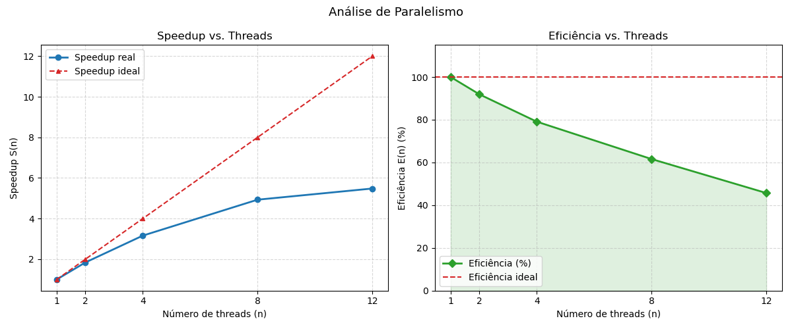

# 🔍 Web Server Log Analysis — Failed Request Detection

> Sistema acadêmico para análise de logs de servidores web utilizando conceitos de Programação Distribuída e Concorrente, com foco na identificação de requisições com falha, detecção de padrões suspeitos e avaliação de desempenho através de processamento paralelo.

---

# 👥 Integrantes

| Nome | RA |
|--------|--------|
| Ana Júlia | 076130 |
| Vinícius Caetano de Assis | 075753 |

---

# 🎓 Informações Acadêmicas

| Campo | Informação |
|--------|--------|
| Curso | Análise e Desenvolvimento de Sistemas (ADS) |
| Disciplina | Programação Distribuída e Concorrente |

---

# 📌 Objetivo do Projeto

Este projeto tem como objetivo analisar grandes volumes de logs de servidores web para identificar requisições com falha (HTTP 4xx e 5xx), detectar possíveis padrões de comportamento suspeito e avaliar os ganhos de desempenho obtidos através do processamento paralelo.

O sistema foi desenvolvido para aplicar na prática conceitos de:

- Programação Concorrente
- Paralelismo
- Sistemas Distribuídos
- Processamento de Grandes Volumes de Dados
- Análise de Logs
- Balanceamento de Carga

---

# 🚀 Funcionalidades

- Leitura de arquivos de log de servidores web
- Identificação automática de códigos HTTP de erro
- Contabilização de falhas por endereço IP
- Associação IP → Hostname
- Geração do ranking dos IPs com mais falhas
- Processamento sequencial para comparação
- Processamento paralelo utilizando multiprocessing
- Medição de desempenho e comparação de tempos
- Geração de grandes bases de teste para benchmark

---

# 🛠 Tecnologias Utilizadas

| Tecnologia | Finalidade |
|------------|------------|
| Python 3 | Linguagem principal |
| Regex (re) | Extração de IPs e códigos HTTP |
| CSV | Leitura do mapeamento IP → Hostname |
| collections.Counter | Contagem eficiente |
| multiprocessing | Execução paralela |
| time | Benchmark de desempenho |

---

# 📂 Estrutura do Projeto

```text
projeto-logs/
│
├── algoritmo.py
│   ├── Implementação sequencial
│   ├── Processa o log linha por linha
│   └── Gera ranking dos IPs com mais falhas
│
├── paralelismo.py
│   ├── Implementação paralela
│   ├── Divide o log em blocos
│   ├── Utiliza multiprocessing.Pool
│   └── Compara desempenho entre diferentes quantidades de processos
│
├── multiplicador.py
│   ├── Ferramenta de geração de massa de testes
│   └── Replica arquivos de log para aumentar o volume de dados
│
├── access.log
│   └── Base principal de análise
│
├── client_hostname.csv
│   └── Relação entre IPs e hostnames
│
└── README.md
```

---

# 📊 Funcionamento

## Etapa 1 — Carregamento dos Dados

O script lê o arquivo ```client_hostname.csv``` e monta um dicionário estruturado ```ip_to_host: dict[str, str]```. Essa operação é puramente sequencial e ocorre antes do processamento pesado.

---

## Etapa 2 — Divisão em Blocos (Chunking) e Gestão de Memória

Para evitar o carregamento de gigabytes de logs na RAM, a função ```iter_chunks``` lê o arquivo linha por linha e agrupa os dados em lotes configuráveis.

Configuração Adotada: ```CHUNK_SIZE = 50_000`` linhas por bloco.

Justificativa Técnica: Este tamanho foi escolhido estrategicamente após testes empíricos. Um bloco muito pequeno (ex: 1.000 linhas) geraria um overhead massivo de comunicação entre processos. Um bloco muito grande (ex: 500.000 linhas) saturaria a memória e diminuiria a granularidade do balanceamento de carga. O valor de 50.000 representa o equilíbrio perfeito entre o uso de memória e a minimização do custo de sincronização.

---

## Etapa 3 — Processamento Paralelo e Regex

Cada processo trabalhador (worker) recebe um bloco isolado de 50.000 linhas e executa a expressão regular compilada:

```python
r"^(\d{1,3}(?:\.\d{1,3}){3}).*?\s([45]\d{2})\s"
```

---

## Etapa 4 — Redução (Reduce) e Ranking

O processo pai coleta os contadores de todos os blocos concluídos, funde-os em um contador global e exibe o Top 10 IPs com mais falhas, enriquecidos com seus respectivos hostnames.

---

# ▶ Como Executar

## 1. Instalar Python

Verifique a instalação:

```bash
python --version
```

ou

```bash
python3 --version
```

---

## 2. Preparar os Arquivos

Mantenha na mesma pasta:

```text
access.log
client_hostname.csv
algoritmo.py
paralelismo.py
```

---

## 3. Executar a Versão Sequencial

```bash
python algoritmo.py
```

ou

```bash
python3 algoritmo.py
```

---

## 4. Executar a Versão Paralela

```bash
python paralelismo.py
```

ou

```bash
python3 paralelismo.py
```

---

## 5. Gerar Massa de Testes

Configure os caminhos em:

```python
path_origem
path_destino
```

e execute:

```bash
python multiplicador.py
```

---

# 📈 Resultados Obtidos

O projeto permite comparar o desempenho da execução sequencial com a execução paralela utilizando diferentes quantidades de processos.

Exemplo:

```text
1 processo  → 114,87 segundos
2 processo → 70,91 segundos
4 processo → 43,74 segundos
8 processo → 32,31 segundos
12 processo → 26,94 segundos
```

Esses resultados permitem avaliar o impacto do paralelismo na análise de grandes arquivos de log.

---
# Speedup

```text
1 processo  → 1,00x (Base)
2 processo → 1,62x
4 processo → 2,63x
8 processo → 3,55x
12 processo → 4,26x
```
---
# Eficiência

```text
1 processo  → 100,0%
2 processo → 81,0%
4 processo → 65,7%
8 processo → 44,4%
12 processo → 35,5%
```
---
# 📉 Gráficos de Desempenho



---

# 🧠 Conceitos Aplicados

- Programação Concorrente
- Paralelismo
- Multiprocessamento
- Processamento de Logs
- Estruturas de Dados
- Expressões Regulares
- Balanceamento de Carga
- Benchmark de Desempenho
- Análise de Dados

---

# 🔗 Base de Dados

Dataset utilizado:

https://www.kaggle.com/datasets/eliasdabbas/web-server-access-logs/data

---

# 📄 Licença

Projeto desenvolvido exclusivamente para fins acadêmicos na disciplina de Programação Distribuída e Concorrente do curso de Análise e Desenvolvimento de Sistemas.
